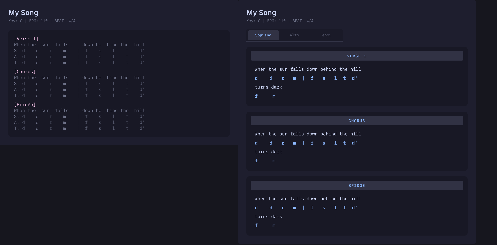

# Choir Sheets

[](https://github.com/thelamina/obsidian-choir-sheets/releases)

Render solfa notation over lyrics in Obsidian — Tonic Solfa, chromatic solfa, and number systems for Soprano, Alto, Tenor, and Chord parts.

<p align="center">
  
</p>

## Features

- **Live preview + reading mode** — blocks render inline; click to edit source, click out to preview
- **Multi-part format** — single code block, all parts: `[S]` soprano, `[A]` alto, `[T]` tenor, `[C]` chords
- **Toggle part tabs** — click tabs to show/hide parts; all active for combined view, one for solo view
- **Color-coded rows** — each part renders in its own configurable color
- **Chord symbols** — `[C]` line renders chord names above lyrics
- **Notation systems** — Tonic Solfa, chromatic (`#`/`b`), and number (1–7)
- **Custom display** — section background, header, and tab colors are all user-configurable

## Usage

### Multi-part format (recommended)

Wrap all parts in a single `choir` code block. Use `[S]`, `[A]`, `[T]`, and `[C]` to mark each part's solfa line. Lyrics are written once and shared.

````
```choir
[Verse 1]
[C] C          G7         Am         F
Here comes the   sun     and   we   sing   a  long
[S] d  r  m  f  |  s  l  t  d'  |  s  s  l  t
[A] l  t  d' r' |  d' t  l  t   |  m  m  f  s
[T] s  s  d  d  |  m  s  t  d   |  d  d  r  m
```
````

Section headers like `[Verse 1]` render as centered badges.

Block language prefix (e.g. `choir`) is configurable in settings.

### Part tabs

All parts are active by default — you see chords, lyrics, and every part's solfa stacked together. Click a tab to hide its part; click again to show it. With one tab active you see that part alone.

## Notation reference

| Natural | Tonic Solfa | Chromatic | Number |
|---------|----------|-----------|--------|
| C       | d        | d         | 1      |
| C#/Db   | di       | #d        | #1     |
| D       | r        | r         | 2      |
| D#/Eb   | mo       | bm        | b3     |
| E       | m        | m         | 3      |
| F       | f        | f         | 4      |
| F#/Gb   | fe       | #f        | #4     |
| G       | s        | s         | 5      |
| G#/Ab   | se       | #s        | #5     |
| A       | l        | l         | 6      |
| A#/Bb   | toh      | bt        | b7     |
| B       | t        | t         | 7      |
| C'      | d'       | d'        | 1'     |

Rests: `z` or `-`

## Settings

### Part colors

| Setting     | Default                 |
|-------------|-------------------------|
| Soprano     | `#3b82f6` (blue)       |
| Alto        | `#ef4444` (red)        |
| Tenor       | `#f59e0b` (amber)      |
| Chord       | `#10b981` (emerald)    |

### Display colors

| Setting              | Default           |
|----------------------|-------------------|
| Section background   | `#1e1e2e`        |
| Header background    | `#2a2a3e`        |
| Header text          | `#3b82f6`        |
| Active tab           | `#2a2a3e`        |

### Other

Default part, Notation system, Block language specifier, toggle solfa highlights, toggle section headers.

## Installation

### Community Plugins

1. Open **Settings → Community Plugins** in Obsidian
2. Disable **Safe Mode** if enabled
3. Click **Browse** and search for "Choir Sheets"
4. Click **Install**, then **Enable**

### BRAT (for beta releases)

1. Install [BRAT](https://obsidian.md/plugins?id=obsidian42-brat)
2. Run command **BRAT: Add a beta plugin for testing**
3. Enter `https://github.com/thelamina/obsidian-choir-sheets`
4. Click **Add Plugin**

### Manual

Download `main.js`, `styles.css`, and `manifest.json` from the [latest release](https://github.com/thelamina/obsidian-choir-sheets/releases) and copy them to `{vault}/.obsidian/plugins/choir-sheets/`.

## Development

```bash
git clone https://github.com/thelamina/obsidian-choir-sheets
cd obsidian-choir-sheets
npm install
npm run build
```

For local testing, symlink the build output into your vault:

```bash
ln -s "$(pwd)/build" /path/to/vault/.obsidian/plugins/choir-sheets
```

Then `npm run build` updates the plugin in place — reload Obsidian to see changes.

## License

MIT
